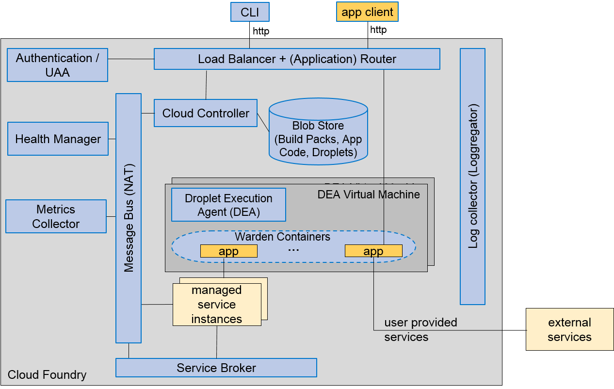
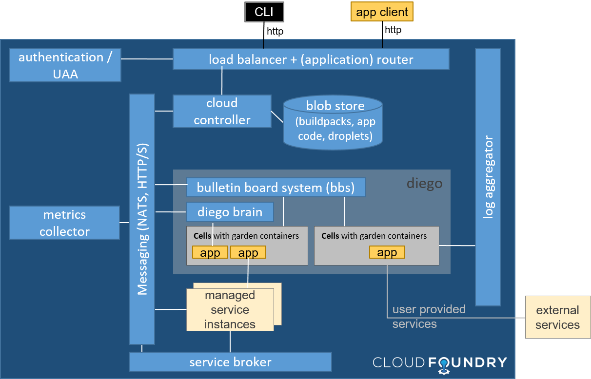
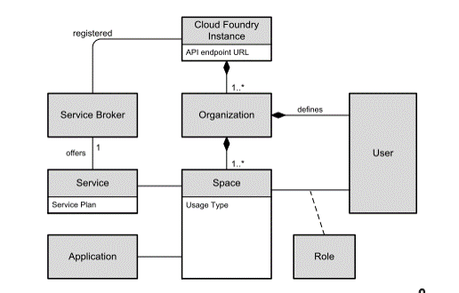

# Cloud Foundry Basics - Detail Notes

## Cloud Foundry @SAP Cloud Platform (SAP CP)

SAP CP - formerly named HANA Cloud Platform - was originally an SAP proprietary Java platform with services such as DB, SAP connectivity, etc. Cloud Foundry is implemented as an additional capability of SAP CP. Technically it is a generic implementation of Cloud Foundry on various IaaS implementations, such as AWS EC2 hosted by Amazon, and includes SAP specific / provided services. This new platform / capability is internally called **Cloud Foundry environment on SAP CP** or sometimes also **CF @SAP CP**.

Cloud Foundry providers (hosters) differ in what backing services they offer and what admin and operations features they support. CF @SAP CP will provide among standard buildpacks extra enterprise support for the SAP Java buildpack, Node.JS community buildpack (Python is planned). In addition it will specifically provide the **SAP specific backing services** such as SAP Identity Management, Cloud Integration, SAP Usage Measurement, Billing, ... and many more, which are unique selling points. Note that HANA backing service is also provided on other Cloud Foundry hostings such as Amazon.

**General: The provider of a CF implementation / CF instance (in this case SAP) has to provide the implementations of the backing services and operate them!** This includes all resource provisioning but also software maintenance, e.g. installing patches etc. The 'user' = developer of a CF instance has nothing to do with operating system patches, DB patches, patches to backing services etc. 

### Positioning of CF versus Neo at SAP Cloud Platform

Please have a look into the One SAP CP Platform Guide (Neo vs. Cloud Foundry) and observe the [**migration document**](https://jam4.sapjam.com/groups/ApFhQ0NCGAzAtXQWsdqB3B/documents/wn4ajuB7u0u84KcSeLI3Gk/slide_viewer).

## Demo - how to try it on your own

This section shows how you can try some CF commands on your own, or do a demo for others. Ensure that you've requested a trial space and that you've installed the CF Client as described here: [CF @SAP CP Help](https://help.cf.sap.hana.ondemand.com/).

Check out an application that can be deployed without depending services e.g. [`origin/solution-2-Hello-World-Resource`](https://github.com/ccjavadev/cc-bulletinboard-ads-spring-webmvc/tree/solution-2-Hello-World-Resource).

#### Login to your personal trial org
Explain that you can create an org per team or product. Explain that you typically would have per org different spaces that reflects the different usage types e.g. test, productive, performance. 
```
$ cf api https://api.cf.sap.hana.ondemand.com
$ cf login       # use C/D/I user and domain password, also asks for org and space selection
$ cf target      # shows the current target settings: CF api, user, org, space
``` 

<sup>
Note: Windows Cygwin has a bug which makes the `cf login` not work in the cygwin bash window. Workaround: Do the `cf login` in a windows CMD window and then continue working in the bash if you like. Make sure the `HOME` variable is set since the login and config data for cf is stored in `~/.cf/config.json`.
</sup>


#### Push your App
Go to the project root folder.

- Show / explain the `manifest.yml` file. While the application name is unique within user/trial space the hostname must be "globally" (across all CF @SAP CP spaces) unique. State out that per default all files within the folder are uploaded. To avoid transferring/persisting unneeded data you either specify the war/jar file as application `path` in the manifest.yml or you ignore them by excluding them in a `.cfignore` file (local configuration files, .git). Most things can be done in the manifest or by providing parameters with the CLI commands. 

```
$ ls -a
$ cf push -n <my-host>
```

Show the url of the deployed app using `cf a``and open it in in the browser.

##### Troubleshooting
To get detailed messages logged to the STD OUT you can execute the following command:
```
$ cf logs <my-app> --recent
``` 

If you face issues while pushing the application, you can split the push step in
* Step: deploy using `cf push -n <my-host> --no-start`
* Step: start the app using `cf start <my-app>`


#### Scale your App
```
$ cf scale - i 2 <my-app>
``` 

## Insights into Cloud Foundry Architecture/Components

### What changes with CF diego runtime
In the CF @SAP CP canary the Diego runtime replaces the traditional DEA runtime.




The main differences are listed here:
- `DEA` gets replaced by `Diego`, which is implemented in [Go](https://golang.org/). `DEA` is now deprecated and gets not any longer supported in 2017.
- `Cloud Controller` contains a "bridge" that translates to Diego
- `Warden` Containerization gets replaced with `Garden`; `Garden`supports Windows beside of Linux
- `Runners` gets replaced with `Cells` the VM the containers get executed in
- There is a new Component `Diego Brain`, the `brain-auctioneer`, it for example decides on which cell a new Garden container gets deployed to. It implements a better algorithm on how to balance the load on VMs and optimize application availability and resilience. Read more about "The auction algorithm" [here](https://docs.cloudfoundry.org/concepts/diego/diego-auction.html). It differs between tasks (i.e. a migration task) and long-running processes (i.e. an application).
But also here, there is no option to configure, control the behavior from "outside".
- `Health Manager` gets replaced with `bbs (Bulletin Board System)`, with that more container can be managed, before there was some limitations in terms of scalability. As of now it stores the data to etcd, which gets replaced by postgresql database in the future.
- Now you have the option to bring / push your own Docker Container. But you're responsible to maintain them i.e. implement Security fixes...
- `cf files` is not supported any longer, you can now connect via `cf ssh` to the Container. With that you can do JMX based monitoring (via Java Monitoring & Management Console). `cf ssh` does not work with the proxy, find workarounds in that respect [here](https://github.infra.hana.ondemand.com/cloudfoundry/cf-docs/wiki/Java-Profiling#troubleshooting). This ssh connection approach will replace the need for Chizzel tunneling in the future.

**Further References**
- https://docs.cloudfoundry.org/concepts/diego/diego-architecture.html
- https://docs.cloudfoundry.org/concepts/diego/dea-vs-diego.html

### Cloud Foundry Orgs, Spaces, Users, ... Metamodel

The [SAP Architecture Whitepaper: Overview of CloudFoundry](https://jam4.sapjam.com/wiki/show/14CZyzq9qQtddxbSrH02TN) contains a good overview of Orgs, Spaces etc. and how they work together. We show an excerpt here.



Key elements:
- **Cloud Foundry Instance:** On top level, choose the instance of the Cloud Foundry offering. For the CLI, this is called the “API endpoint”. This is like the management URL of a Web Hoster. 
- **Organization:** A development account in Cloud Foundry is called Organization. Cloud Foundry user accounts are defined per Organization. 
- **Space:** Within one Organization, multiple spaces can be used depending on the usage type, for example production, testing, sandbox. Users can have different roles depending on the space. Applications and Services are scoped to spaces. 
- **Service Brokers:** Services are offered by Service Brokers. They actually create and delete the service instances 
following a service plan (see below). Service Brokers are mapped to a Cloud Foundry instance. 
- **Service Plan:** One service can be offered in different service levels, called Service Plan, providing different levels 
of scalability and availability in the same PaaS offering. For example, a database service can be offered as a shared DB (using an application-specific DB schema and user), as an isolated DBMS instance with its own DB, or as a database cluster. 
- **Users and Roles:** You have a user within the CF instance (at SAP internally, this is connected to the central domain login so that you can use your D-/I-number and domain password). Users are assigned to organizations. Users have Roles within Spaces (e.g. Developer, Admin, etc.)
- **Applications / Apps:** Apps are deployed into a space. 

### Buildpacks vs. Droplet
**Buildpack** - A set of scripts that provide framework and runtime support for your application. It determines what dependencies to download and how to configure applications to communicate with bound services. It aims on creating a self-contained container executable called Droplet.

**Droplet** - An archive within Cloud Foundry that contains the app code and all further resources ready to run on a DEA. A droplet is the result of the application staging process.

#### Which Buildpack?
To find the buildpack versions that are provided at a particular Cloud Foundry instance, i.e., on Cloud Foundry@SAP CP you can use:
```
$ cf buildpacks
```
Good practices: If you favor stability over bug fixes you should specify the build pack with fixed version in your application `manifest.yml`. This should be done for productive applications. In order to detect faster upcoming problems with newer buildpack versions it is recommended to test against the system buildpack as part of the continuous delivery pipeline.

To automatically pick the system buildpack, use the name shown in `cf buildpacks` (e.g. `sap_java_buildpack`).
To use a specific version, use the URL (e.g. `https://github.com/cloudfoundry/java-buildpack#v3.5.1`).

We also recommend to follow the [cf.users mailing list](https://listserv.sap.corp/mailman/listinfo/cf.users) to get the announcements after every CANARY update. These announcements contain links to the corresponding release notes, which also mention updates to standard buildpacks.

### CPU scaling
As long as a single DEA node (running multiple microservices) is not on full CPU capacity, each microservice instance running on that node gets as much CPU time as required. If a node is on full capacity, the CPU is shared depending on the memory size of each application instance: more memory means instance gets more CPU time. In other words, if you configure double the memory for your microservice, you also get double the CPU cycles (on nodes running on full CPU capacity).

- http://stackoverflow.com/questions/24569978/number-of-cpu-cores-available-for-a-cloudfoundry-application
- https://groups.google.com/a/cloudfoundry.org/forum/#!topic/vcap-dev/1oxtopsHDkU


# Further Materials

## CF Overview Resources
- CF Basic Overview: http://docs.cloudfoundry.org/concepts/overview.html
- CF Component Overview: http://docs.cloudfoundry.org/concepts/architecture/
- CF Youtube channel: https://www.youtube.com/user/CloudFoundry

## CF Internals
- [CF Offerings @SAP - Background on terminology and semantics](https://github.com/ccjavadev/cc-coursematerial/blob/master/CloudFoundryBasics/CloudOfferings.md)
- [CF Architecture Video](http://www.infoq.com/presentations/Cloud-Foundry-Architecture)
- [CF Architecture Video 2](https://www.youtube.com/watch?v=oXExLtmw0q4)
* CF Container technology: Warden, Docker, Diego. [Comparison article](http://blog.altoros.com/cloud-foundry-containers-warden-docker-garden.html)


