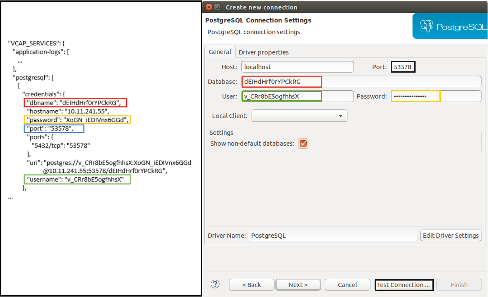

# [Optional] Exercise 10 - 2: Connecting to a CF Backing Service

## Learning Goal

Sometimes it can be useful to connect to a Cloud Foundry Backing Service directly. Maybe you would like to check the contents of
a database. In this exercise you are going to connect to your `Postgresql` Backing Service, which you have already installed
for your application in an earlier exercise. 

You will learn how to open a SSH tunnel to your application and connect and analyze the database entries in the `DBeaver` eclipse plugin. CF runtime Diego provides standard SSH access that is secure and restricted to the org and space of your application.


## Prerequisites

- Your application is deployed on Cloud Foundry and is bound to a `Postgresql` Backing Service as done in [Exercise 10](https://github.wdf.sap.corp/cc-java-dev/cc-coursematerial/blob/master/ConnectDatabase/Exercise_10_DeployAdsWithDBServiceOnCF.md).
- Switch to Proxyless Environment as documented [here](https://github.wdf.sap.corp/cc-java-dev/cc-coursematerial/blob/master/LoggingTracing/Exercise_15_Debug_CF_Application.md).

## Step 1: Lookup Credentials for Postgresql

In order to connect to the `Postgresql` Backing Service on Cloud Foundry you have to lookup the credentials using `cf env` command.

```
cf env bulletinboard-ads

{
 "VCAP_SERVICES": {
  "application-logs": [
   ...
  ],
  "postgresql": [
   {
    "credentials": {
     "dbname": "dEIHdHrf0rYPCkRG",
     "hostname": "10.11.241.55",
     "password": "XoGN_iEDIVnx6GGd",
     "port": "56233",
     "ports": {
      "5432/tcp": "53578"
     }
...
```
## Remarks for productive environments
**Never copy the credentials from your productive Cloud Foundry!** There are better ways to receive a *temporary* so-called `service key` which should be used instead.
```
cf create-service-key <service-instance-name> mykeyname
cf service-key <service-instance-name> mykeyname
```
When no longer needed, delete such a tuple with `cf delete-service-key <service-instance-name> mykeyname`.

## Step 2: Open Tunnel to Postgresql Backing Service

You now have to open a tunnel to that Backing Service. For that you have to use the `hostname` and the `port`
which can be taken from the `VCAP_SERVICES` environment variable.

```
# cf space-ssh-allowed <space name>
cf ssh bulletinboard-ads -N -T -L 53578:10.11.241.55:53578
```

This command blocks the commandline. (There will be no answer.)

## Step 3: Create a Connection in Eclipse using the DBeaver Eclipse Plugin

When you have opened the tunnel to the `postgresql` Backing Service, use the information given in the `VCAP_SERVICES` environment variable to create the connection using the `DBeaver` Eclipse plugin.

- Switch to the `DBeaver` perspective.
- Right-click in the `Database Navigator` view and choose `Create New Connection` in the context menu.
- Enter the credentials as shown in the screenshot:



Now click on `Test Connection`. If everything went fine then you should see `Connection is OK`.

## Step 4: Open the Connection [Optional]

If the connection did not open automatically, right-click on the connection you've created and click on `Connect` in the context menu.
Now you should be able to inspect the tables and their respective contents in the `Database Navigator` view.

## Step 5: Close the SSH tunnel
Close the SSH tunnel by pressing `CTRL+C` in the command line.


## Used frameworks and tools
- [DBeaver Eclipse Plugin](https://marketplace.eclipse.org/content/dbeaver) for a convenient access of your local database
- [cf ssh command](https://docs.cloudfoundry.org/devguide/deploy-apps/ssh-apps.html)

## References and further reading
- [CF docs: Accessing Services with SSH](https://docs.cloudfoundry.org/devguide/deploy-apps/ssh-services.html)
- [Connecting to a Backing Service](https://wiki.wdf.sap.corp/wiki/display/docservice/CF+Development+Tips#CFDevelopmentTips-DebugginginCF) (Section **Tunneling to a service instance**)
- [Instruction: How to open a ssh connection and enable debugging in a proxy environment](https://wiki.wdf.sap.corp/wiki/display/Indigo/How+to+open+a+ssh+connection+and+enable+debugging+in+a+proxy+environment)

***
<dl>
  <dd>
  <div class="footer">&copy; 2018 SAP SE</div>
  </dd>
</dl>
<hr>
<a href="/ConnectDatabase/Exercise_10_DeployAdsWithDBServiceOnCF.md">
  
</a>
<a href="/ConnectDatabase/Exercise_11_Develop_Custom_Queries.md">
  
</a>
