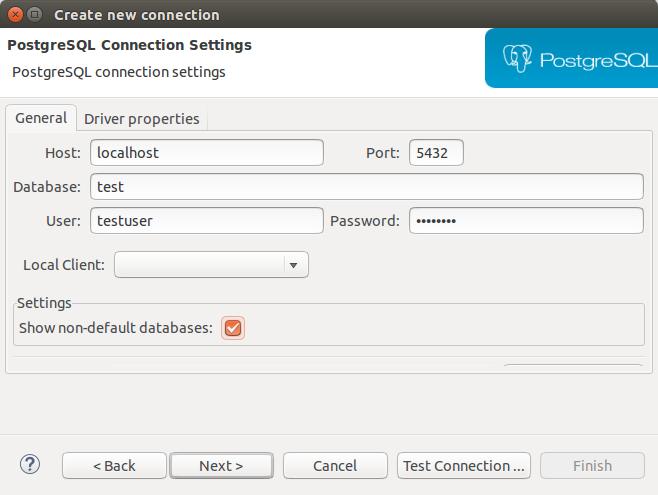

Exercise 7: Connect to Local Database within Eclipse IDE
========================================================

## Learning Goal
In this exercise you will learn how to setup a connection to the database running inside your virtual machine (Note: All backing services needed in this course are also running locally in the VM to allow local tests and debugging).
Furthermore, you will get to know the `VCAP_SERVICES` environment variable and understand how it can be used for local databases.

## Prerequisite
Continue with your solution of the last exercise. If this does not work, you can checkout the branch [`origin/solution-6-Deploy-Ads-On-CF`](https://github.com/ccjavadev/cc-bulletinboard-ads-spring-webmvc/tree/solution-6-Deploy-Ads-On-CF).

**[Changes](#changes-since-video-recording) since video recording**.

## Step 1: Connect to Local Database in Eclipse
We want to manage the connection to the PostgreSQL database within Eclipse using the [`DBeaver` eclipse plugin](https://marketplace.eclipse.org/content/dbeaver).

Install this plugin from the Eclipse Marketplace and open the `DBeaver` perspective (under `Window` -> `Perspective` -> `Open Perspective`).

We have to create a new connection in the `Database Navigator` view as follows:

* Right click and select `Create New Connection`
* Select "PostgreSQL" from the list of connection types and hit "Next".
* Enter the following settings (also see screenshot) and proceed. All the other settings may remain at their default values. The JDBC URL will be filled automatically.
  * host: localhost
  * port: 5432
  * database (name): **test**
  * user: testuser
  * password: test123!
* Pressing the button "Test Connection" or switching to the "Driver properties" tab will open a download screen which will download the appropriate driver for you.
* Press "Next" or "Finish" and the creation of the connection is completed.

You can connect to the database by simply double-clicking the connection in the `Database Navigator` view.

If you get the error message "Can't create driver instance" when trying to connect, the PostgreSQL driver was not (successfully) downloaded. Retry by editing the connection and make sure to confirm the download. 

Make sure, that the `test` database appears in **bold**, which means that this is the current active one.

Starting from next exercise (when the tables are created), you can view the contents of a database table by double-clicking the name of the table under `public` -> `Tables` and then choose `Data` from the main view.

## Step 2: Understand VCAP_SERVICES
Open the file [`localEnvironmentSetup.bat`](https://github.com/ccjavadev/cc-bulletinboard-ads-spring-webmvc/blob/master/localEnvironmentSetup.bat) (or `localEnvironmentSetup.sh`) in an editor.
Find the definition of the `VCAP_SERVICES` local variable and understand how it is used to define the database connection information.

## Step 3: Configure your Eclipse Tomcat Server
The `localEnvironmentSetup` script is used to set the environment variables in the current command line session, which is required when you like to run your application locally using `mvn tomcat7:run`. But in case you like to deploy 
your application in Eclipse, these environment variables needs to be applied to your Tomcat server configuration as well.

- In the server view right-click your server and choose **Open**.
- Select **Open launch configuration**
- In the Edit launch configuration properties dialog switch to the **`Environment`** tab.
- Add variable value pairs for these variables `VCAP_APPLICATION`, `VCAP_SERVICES` and `USER_ROUTE`; you can lookup the values from [`localEnvironmentSetup.bat`](https://github.com/ccjavadev/cc-bulletinboard-ads-spring-webmvc/blob/master/localEnvironmentSetup.bat).

## Changes since video recording
As `Toad Extension` is not anymore freeware (as communicated [here](https://www.toadworld.com/products/toad-extension-for-eclipse)) we've replaced it by the `DBeaver` Eclipse Plugin. 

## Further reading / tools
- [Cloud Foundry Environment Variables](http://docs.run.pivotal.io/devguide/deploy-apps/environment-variable.html#VCAP-SERVICES)
- [DBeaver Eclipse Plugin](https://marketplace.eclipse.org/content/dbeaver) for a convenient access of your local database

***
<dl>
  <dd>
  
&copy; 2018 SAP SE

  </dd>
</dl>

