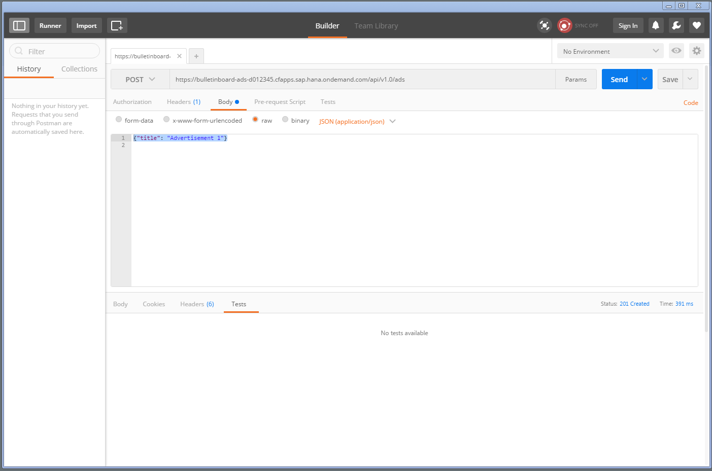

Exercise 3: Create Advertisement Endpoints
==========================================

## Learning Goal
After this exercise you will have a more detailed understanding of REST basics (header, body, entity, status code). You will see how easy it is to build RESTful Web services using Spring Web MVC. You will benefit from the JSON conversion provided by [Jackson](../Knowledge/JSONConversion.md).

The task in this exercise is to implement the REST-services with responses as defined below. From now on we will return JSON, i.e. the response type should always be `application/json`. Note that by choosing a combination of Spring WebMVC and the specific JSON converter, our standard response type will actually be `application/json;charset=UTF-8`  (you will spot that in the tests created in [Exercise 4](https://github.wdf.sap.corp/cc-java-dev/cc-coursematerial/blob/master/CreateMicroservice/Exercise_4_CreateServiceTests.md)).

| HTTP Verb |  CRUD      | collection/unspecific (e.g. `/api/v1/ads/`)   | specific item (e.g. `/api/v1/ads/0`)|   
| ----------- | ---------- | ------------------------------------ | ------------------------------------- |
| POST        | Create     | 201 (Created), single ad, `Location` header with link to `/api/v1/ads/{id}` | 405 (Method not allowed) |
| GET         | Read       | 200 (OK), list of advertisements | 200 (OK), single ad; 404 (Not Found), if no advertisement with this ID exists |

## Prerequisite
Continue with your solution of the last exercise. If this does not work, you can check out the branch [`origin/solution-1-Activate-Actuator`](https://github.wdf.sap.corp/cc-java/cc-bulletinboard-ads-spring-webmvc/tree/solution-1-Activate-Actuator).

## Step 1: Create Advertisement Service
The goal is to implement the service endpoints as specified in the table above.
The individual ads should be represented by a new class `Advertisement` which contains a title (`String`) property.

- Create an `Advertisement` class in the package `com.sap.bulletinboard.ads.models`.
  - Then, in the `Advertisement` class, create a field named `title`. **Note that the JSON converter requires a default constructor (either implicitly, i.e. no constructor defined, or explicitly) and public setters and getters for private fields!**

- Create a `AdvertisementController` class in the package `com.sap.bulletinboard.ads.controllers`:
```java
import org.springframework.http.MediaType; //provides constants for content types
import org.springframework.http.HttpStatus; //enumeration for HTTP status codes

@RestController
@RequestMapping() //TODO: specify path and optionally contentType 
public class AdvertisementController {
    public static final String PATH = "/api/v1/ads";
    private final Map<Long, Advertisement> ads = new HashMap<>(); //temporary data storage, key represents the ID
    
    @GetMapping
    public AdvertisementList advertisements() {
        return null; //TODO
    }

    @GetMapping("/{id}")
    public Advertisement advertisementById(@PathVariable("id") Long id) {
        return null; //TODO
    }

    /**
     * @RequestBody is bound to the method argument. HttpMessageConverter resolves method argument depending on the
     *              content type.
     */
    @PostMapping
    public ResponseEntity<Advertisement> add(@RequestBody Advertisement advertisement,
            UriComponentsBuilder uriComponentsBuilder) {
        return null; //TODO return ResponseEntity with advertisement in the body, location header and HttpStatus.CREATED status code
    }
    
    public static class AdvertisementList {
        @JsonProperty("value")
        public List<Advertisement> advertisements = new ArrayList<>();

        public AdvertisementList(Iterable<Advertisement> ads) {
            ads.forEach(advertisements::add);
        }
    }    
}
```

**Some implementation hints:**
- When building the `location` header for a POST request, you can build the required URI using the `UriComponentsBuilder`:
```java
UriComponents uriComponents = uriComponentsBuilder.path(PATH + "/{id}").buildAndExpand(id);
HttpHeaders headers = new HttpHeaders();
headers.setLocation(new URI(uriComponents.getPath()));
```
- Choose a trivial method of generating an ID, e.g. via static counter or by examining the size of the hash map. We will replace the map with database persistence in [Exercise 8](https://github.wdf.sap.corp/cc-java-dev/cc-coursematerial/blob/master/ConnectDatabase/Exercise_8_Part1_ConfigurePersistence.md).
- Find a sample solution [here](https://github.wdf.sap.corp/cc-java/cc-bulletinboard-ads-spring-webmvc/blob/solution-3-Create-Ads-Endpoints/src/main/java/com/sap/bulletinboard/ads/controllers/AdvertisementController.java). Note: The sample solution represents the final solution after step 5.
- Note that we offer a relative [URI-reference](https://tools.ietf.org/html/rfc3986#section-4.2) as location
- Consider the `Troubleshooting` section below.
- Use the `AdvertisementList` class instead of `Iterable<Advertisement>` as collection of Advertisements. With that we are able to expose the JSON as recommended in [SAP's Guidelines for Future REST API Harmonization](https://www.sap.com/documents/2017/12/ba1141bf-e37c-0010-82c7-eda71af511fa.html).

## Step 2: Run Microservice Locally
As described here: [Exercise 1: Getting Started](https://github.wdf.sap.corp/cc-java-dev/cc-coursematerial/blob/master/CreateMicroservice/Exercise_1_GettingStarted.md)

## Step 3: Test using REST Client
Test the REST Service `http://localhost:8080/api/v1/ads` manually in the browser using the `Postman` chrome plugin. 
- **POST two advertisements**
- As shown in the screen shot below, set the body type to **raw JSON (application/json)**
(`{"title": "Advertisement 1"}`)
This results in the content-type header being set to `Content-Type=application/json` 



- Ensure that the location is returned in the header and that the entity is returned in the body. In case an error occurred, please have a closer look at the response. For example, your `Advertisement` entity must have a default constructor when using Jackson.
- **GET all advertisements**  
Ensure that all created advertisements are returned.
- **GET advertisement with id=0**    
Ensure that the advertisement you created before is returned.

## Troubleshooting
- If you experience any problems while implementing the following exercise steps, make sure to check the `Console` output in Eclipse. For most common errors Tomcat/Spring show a helpful error message, even if the output shown in the browser (or Postman) does not help.
- **The POST-request returns a "bad request"(status code: 400) and I'm unable to debug it.** One possible reason could be that your Advertisement class does not specify a constructor without parameters (either implicitly or explicitly). Explanation: The [Jackson JSON provider](../Knowledge/JSONConversion.md) requires a default constructor. In this case you will also not be able to debug, as the Jackson JSON provider intercepts the request and tries to convert the entity before your method in the AdvertisementController is executed. 
Before you re-deploy your application to the Tomcat server, a `clean...` of your Tomcat server might be required.
- Also, feel free to have a look at our [solution](https://github.wdf.sap.corp/cc-java/cc-bulletinboard-ads-spring-webmvc/tree/solution-3-Create-Ads-Endpoints).

## [Optional] Step 4: Return Not Found status
- In case the advertisement for a specific ID is requested (`/ads/{id}`) but no advertisement for this ID exists, the service method should return the HTTP status code 404 (Not Found). To do this, simply raise a `com.sap.bulletinboard.ads.controllers.NotFoundException`.
- Also test the correct behavior with the REST client.

## [Optional] Step 5: Use Request Scope
Singleton scope is the default scope of Spring beans! Consequently the `AdvertisementController` instance is created only once and is used for all requests. This means that usually many requests will be active in many threads in the same instance and this creates all kinds of issues concerning thread-safety. 

In this task you should now change this, so that a new object instance is created and used for each incoming request which helps us avoid all threading / synchronization issues:
- Add `@Scope(WebApplicationContext.SCOPE_REQUEST)` to the controller's class definition or simply add `@RequestScope`.
- Test your implementation.

But now the created advertisements are not properly stored for subsequent requests anymore! The reason is that we store advertisements in a map, which is now re-created (without any content) for each request.

- Repair your implementation by adding the `static` modifier to your map. 
 
You can now store Advertisements as before, but the issue of thread safety is unresolved again. It does not matter in our case, since we will store Advertisements in the database later. For threading issues with Maps you can look e.g. at the blog post [How a Hashmap can be synchronized](http://stackoverflow.com/questions/1291836/concurrenthashmap-vs-synchronized-hashmap).


## Used Frameworks and Tools
- [Spring Web annotations - JavaDoc](http://docs.spring.io/spring-framework/docs/current/javadoc-api/)
- [Spring Web MVC](http://docs.spring.io/spring/docs/current/spring-framework-reference/html/mvc.html)
- [Jackson JSON provider](../Knowledge/JSONConversion.md)
- [Postman REST Client (Chrome Plugin)](https://chrome.google.com/webstore/detail/postman/fhbjgbiflinjbdggehcddcbncdddomop)

## Further Notes
- [HTTP Methods for RESTful Services](http://www.restapitutorial.com/lessons/httpmethods.html)
- [HTTP Status Codes](http://www.restapitutorial.com/httpstatuscodes.html)


***
<dl>
  <dd>
  <div class="footer">&copy; 2018 SAP SE</div>
  </dd>
</dl>
<hr>
<a href="Exercise_2_HelloWorldResource.md">
  
</a>
<a href="Exercise_4_CreateServiceTests.md">
  
</a>
