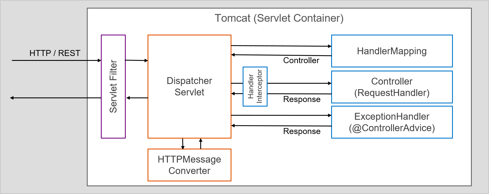
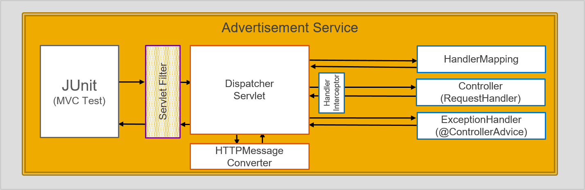

# Creating a MicroService - Additional Notes

## HTTP Methods
The table below shows the most important HTTP methods.

| Method | Semantics | Comments |
|--------|-----------|----------|
| GET    | get data  | to get data; can be cached and bookmarked, remains in browser history, URL has length restriction (1024 bytes) |
| POST   | create new | create new; is never cached, cannot be bookmarked; does not go into browser history; no restriction on size / length; also used to push data from  forms |
| PUT    | update instance data | instance ID must be given as parmameter (usually URI segment) |
| PATCH  | partially update instance data | instance ID must be given as parmameter (usually URI segment) |
| DELETE | delete instance data | instance ID must be given as parmameter (usually URI segment) |

### HTTP2.0
Java 9 (Servlet 4.0) and Tomcat 9 will support the new HTTP2.0 protocol.

## Spring Web MVC Framework Explained
Spring moves requests between a *dispatcher servlet*, *handler mappings*, *controllers* and *view resolvers* ( in case you provide an User Interface). In order to enable those Spring Web MVC components and other beans like the `UriComponentsBuilder` they need to be registered. In our (non-Spring Boot context) this is explicitly done by adding the `@EnableWebMvc` to an `@Configuration` class, which basically imports the Spring MVC configuration from [WebMvcConfigurationSupport](http://docs.spring.io/spring/docs/current/javadoc-api/org/springframework/web/servlet/config/annotation/WebMvcConfigurationSupport.html). 

#### Components Explained

- `DispatcherServlet` is the front "controller" and initial entry point of any request after it was successfully processed by the `ServletFilter` filter chain. It loads the beans containing the Web components that were introduced here and the `ContextLoaderListener` loads the other beans of your application ([Example](https://github.com/ccjavadev/cc-bulletinboard-ads-spring-webmvc/blob/solution-24-Make-App-Secure/src/main/java/com/sap/bulletinboard/ads/AppInitializer.java)).
- The `HandlerMapping` knows the (Rest) Controller method that handles the request. The mapping is configured within the controller on the class level with `@RequestMapping` annotation and can be complemented by annotations on the handler methods.
- `Controller` class (annotated with `@Controller`,  `@RestController`) defines the endpoints and handles the request. ([Example](https://github.com/ccjavadev/cc-bulletinboard-ads-spring-webmvc/blob/solution-24-Make-App-Secure/src/main/java/com/sap/bulletinboard/ads/controllers/AdvertisementController.java)).
- `HTTPMessageConverter` marshall and unmarshall Java Objects to and from JSON, XML, etc – over HTTP. By default, there are a bunch of implementations pre-enabled like `StringHttpMessageConverter` for String conversion or `MappingJacksonHttpMessageConverter` for JSON messages (added only if Jackson is present on the classpath).
- `ExceptionHandler` maps typically an exception raised as part of the controller to an "Http Status Code" and to a specific message. It is declared in an `@ExceptionHandler` annotated method as part of the Controller or an `@ControllerAdvice` annotated class, which is then applicable for the entire application ([Example](https://github.com/ccjavadev/cc-bulletinboard-ads-spring-webmvc/blob/solution-5-ValidationExceptions/src/main/java/com/sap/bulletinboard/ads/controllers/CustomExceptionMapper.java)).
- `HandlerInterceptor` intercepts a request just before /after a handler is executed, to add common preprocessing behavior to a certain group of handlers without needing to modify each handler implementation. Its main purpose is to allow for factoring out repetitive handler code. 
- `ServletFilter` can modify or even filter out requests that should never be processed like in our case unauthenticated or unauthorized requests. The `RequestLoggingFilter` adds the correlation id into the request header, which is relevant for correlating log messages, that belong to the same "origin" request ([Example](https://github.com/ccjavadev/cc-bulletinboard-ads-spring-webmvc/blob/solution-24-Make-App-Secure/src/main/java/com/sap/bulletinboard/ads/AppInitializer.java)).


## Spring Test MVC Framework



Directly from the beginning we would like to test our microservice (component) in an integrated way. We want to test against the REST API of our web application but without doing calls to an foreign microservice (component). Furthermore the tests should run in any environment out-of-the-box without the need of installing a database like postgresql. To sum it up, certain features (like a database connection) are not desired in this kind of tests, as consequence we need to adapt the Spring application context slightly. 

The `org.springframework.mock.web` package contains a comprehensive set of Servlet API mock objects, which are useful for testing web application contexts, controllers, and filters. These mock objects are targeted at usage with Spring’s Web MVC framework and provides an effective way for testing controllers by performing requests and generating responses through the actual `DispatcherServlet`. 

As you can see on the picture, the tests run server-side only without the need of an (embedded) web server, which reduces the startup time and gives you the option to inject mocked services into the Spring `TestContext`.

#### Setup Explained
In this option we load Spring MVC configuration through the *TestContext framework*, which loads the Spring configuration and injects a `WebApplicationContext` for building a `MockMvc` instance:

```java
@RunWith(SpringJUnit4ClassRunner.class) // or @RunWith(SpringRunner.class)
@ContextConfiguration(classes = { WebAppContextConfig.class })
@WebAppConfiguration
public class ControllerTest {
    
    @Inject
    WebApplicationContext context;

    private MockMvc mockMvc;
    
    @Inject
    private Filter springSecurityFilterChain;
    
    @Before
    public void setUp() throws Exception {
        mockMvc = MockMvcBuilders.webAppContextSetup(context).addFilter(springSecurityFilterChain).build();
    }

```
The `@ContextConfiguration` allows us to configure the the Spring `ApplicationContext` for our integration test. Note: as `WebAppContextConfig` class enables `ComponentScan` for all packages, also all classes annotated with `@Configuration` or `@Component` are detected and added to the application contect.

The `@WebAppConfiguration` is used to declare that the ApplicationContext loaded for an integration test should be a `WebApplicationContext`. Behind the scenes it creates a `MockServletContext` which serves as the ServletContext for the tests containing "all" Spring Web MVC components.

With [Exercise 24](https://github.com/ccjavadev/cc-coursematerial/blob/master/Security/Exercise_24_MakeYourApplicationSecure.md) we are going to introduce Spring Security and accordingly the `springSecurityFilterChain` as `ServletFilter`. In a Spring Mvc Test we need to ensure that the filter is applied to the MockMvc as shown in that [Example](https://github.com/ccjavadev/cc-bulletinboard-ads-spring-webmvc/blob/solution-24-Make-App-Secure/src/test/java/com/sap/bulletinboard/ads/controllers/AdvertisementControllerTest.java). 

Read more about the `Spring MVC Test Framework` [here](http://docs.spring.io/spring/docs/current/spring-framework-reference/html/integration-testing.html#spring-mvc-test-framework).

#### Tip for managing Static Imports
The fluent API in the example above requires a few static imports such as `MockMvcRequestBuilders.*`, `MockMvcResultMatchers.*`, and `MockMvcBuilders.*`. If using Eclipse, be sure to add them as "favorite static members" in the Eclipse preferences under `Java` → `Editor` → `Content Assist` → `Favorites`. That will allow use of content assist after typing the first character of the static method name. Other IDEs (e.g. IntelliJ) may not require any additional configuration. Just check the support for code completion on static members.

## Note: REST versus SOAP
Some people say that "REST is just like SOAP and what we have always done!". This is not true at all - and shows a serious lack of understanding! For a good article on the significant differences see the article [Richardson REST Maturity Model](https://martinfowler.com/articles/richardsonMaturityModel.html) by Martin Fowler, as well as [REST APIs](http://roy.gbiv.com/untangled/2008/rest-apis-must-be-hypertext-driven) by Roy Fieldings, one of the principal authors of the HTTP spec and the originator of REST.

## Further Reading
- [Assembly and Initialization explained](https://github.com/ccjavadev/cc-coursematerial/blob/master/Knowledge/AssemblyAndInitialization.md)
- [Our Tool Decisions](/_Internals/Tool_Decisions.md)
- You can find a general overview of http [here](https://en.wikipedia.org/wiki/Hypertext_Transfer_Protocol).
- [Http header fields reference](https://en.wikipedia.org/wiki/List_of_HTTP_header_fields#Request_fields)
- Http status codes [in detail](https://en.wikipedia.org/wiki/List_of_HTTP_status_codes) and [as table](http://www.cheatography.com/kstep/cheat-sheets/http-status-codes/)
- There are several good articles on good REST API design, e.g. [Best practices for restful APIs ](http://www.vinaysahni.com/best-practices-for-a-pragmatic-restful-api), and [REST cheat sheet](http://51elliot.blogspot.de/2014/03/rest-api-best-practices-rest-cheat-sheet.html) or a pretty good tutorial and reference [Refcardz: Foundations of RESTful architecture](https://dzone.com/refcardz/rest-foundations-restful).
- [Richardson Maturity Model - steps toward the glory of REST](http://martinfowler.com/articles/richardsonMaturityModel.html)
- [Spring MVC Test Framework](http://docs.spring.io/spring/docs/current/spring-framework-reference/html/integration-testing.html#spring-mvc-test-framework).
