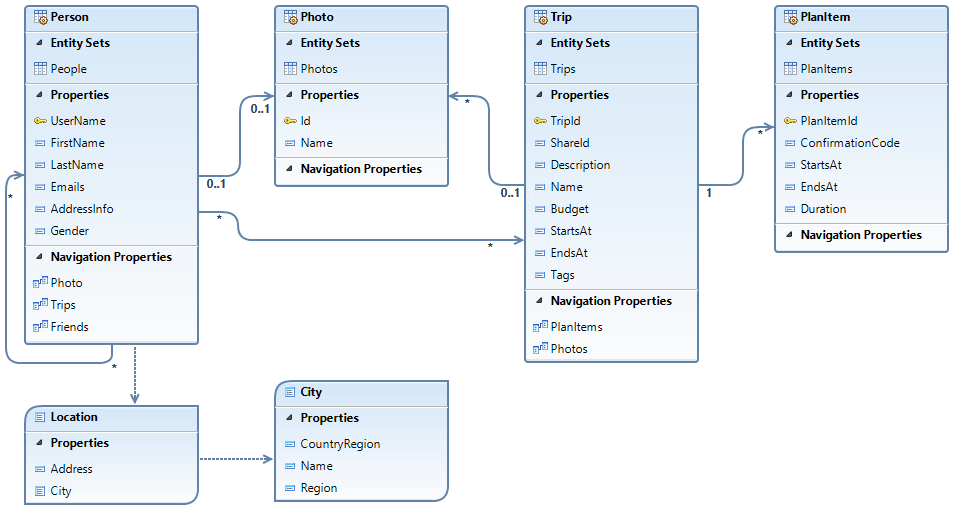

This article is authered by **Ralf Handl**.

# Why OData?
OData is an open, extensible [OASIS standard](https://www.oasis-open.org/committees/tc_home.php?wg_abbrev=odata) for building REST APIs and can be considered as the ODBC/SQL for the web.
OData comes in handy when there is a need to build consistent REST APIs at broad-scale. 
Its standardized interaction patterns and data query capabilities provide all necessary ingredients for building web-based state-of-the-art UIs leveraging smart UI controls and smart templates relying on uniform service behavior and rich metadata. 

Note that if a service is to be consumed directly in the UI layer (Fiori/SAPUI5) then the UI workflow will influence the API design which will make it likely less reusable. In this case the recommended way to expose the API is OData. [SAPUI5](https://sapui5.netweaver.ondemand.com/sdk/#docs/guide/95d113be50ae40d5b0b562b84d715227.html) provides sufficient means for automatic two-way binding and discovery of control properties with OData-based services, which makes development of standardized SAP UIs in Fiori paradigm much easier. The guideline for defining and implementation of OData interfaces in Java can be found [here](http://olingo.apache.org/).

# OData in a Nutshell
OData is **ODBC/SQL for the web** – it provides everything needed for building highly consistent services:
- Standardized, powerful query language 
- Standardized interaction patterns 
- Standardized rich metadata for self-describing services
- Metadata Extensibility via vocabulary-based annotations

Each OData service is defined by its entity-relationship model, here a graphically visualized example:

OData entities have:  
-	Key properties that identify an entity (instance)
-	Data properties that carry data (potentially structured, e.g. AddressInfo has type CT_Location, City has type CT_City)
-	Navigation properties that lead to related entities

This allows straight-forward mapping between OData services and **logical data models** (views, OO APIs).

OData and **Core Data Services (CDS)** are a perfect match, both go beyond plain SQL by making relationships (navigation properties in OData, associations in CDS) first-class citizens that can be used for easy data retrieval using these pre-defined joins.

# OData Advantages 
## OData services are self-describing
Each OData service contains a standardized XML description of its entity-relationship model and top-level resources as a [$metadata resource](http://services.odata.org/V4/(S(nkuzj1roqxbwkhltzhzrtlry))/TripPinServiceRW/$metadata). This eases the service consumption by enabling generic clients such as run-time frameworks or design-time tools to easily discover and interact with any OData service. 

## OData offers a smart way to extend the service metadata
OData **$metadata is extensible** and can be **enriched with annotations** describing **business semantics** and UI rendering hints – smart controls and smart players/templates can be fine-tuned by the service itself.

## OData defines standardized interaction patterns for CRUD operations
-	[GET entity set](http://services.odata.org/V4/(S(nkuzj1roqxbwkhltzhzrtlry))/TripPinServiceRW/People) -> SELECT FROM view/table
-	POST entity to entity set -> INSERT INTO view/table 
-	[GET entity](http://services.odata.org/V4/(S(nkuzj1roqxbwkhltzhzrtlry))/TripPinServiceRW/People('russellwhyte')?http://services.odata.org/V4/(S(nkuzj1roqxbwkhltzhzrtlry))/TripPinServiceRW/People) -> SELECT SINGLE
-	PATCH entity -> UPDATE row
-	DELETE entity -> DELETE row

Request and response payload formats are consistently derived from entity-relationship model, making them easy to consume for clients – **what you GET is what you PATCH or POST**.

## OData allows defining service-specific actions and functions for pre-packaged business logic
-	Actions for pre-packaged changes
-	Functions for pre-packaged queries

Actions and functions are described in service metadata, discoverable for generic clients.

## OData defines a standardized powerful query language for accessing entity sets

| OData query option  | SQL keyword           | Example URL                  |
| ------------------- | ----------------------| ---------------------------- |
| `$filter`           | `WHERE`               | `GET People?$filter=startswith(LastName,'K')`|
| `$select`           | `SELECT`              | `GET People?$select=LastName,Gender` |
| `$orderby`          | `ORDER BY`            | `GET People?$orderby=LastName asc` |
| `$top`              | `LIMIT`               | `GET People?$top=3` |
| `$skip`             | `OFFSET`              | `GET People?$skip=2` |
| `$expand`           | `JOIN`                | `GET People?$expand=Friends` |

Note: these example URLs work if http://services.odata.org/V4/TripPinServiceRW/People is used instead of just People

These query options can be combined for tailoring requests to the data needs of a specific consumer without having to pre-think all possible combinations. 
OData queries provide **built-in service adaptation** without needing additional middleware.
OData queries can be **pushed down to the database**, or **intercepted by a query engine** of choice. 
The **standardized query options** allow building **standardized UI components**, smart controls, and **smart players/templates** that rely on this **uniform service behavior**.

## OData allows batch requests allow controlling LUWs and minimizing round-trips
A group of data modification requests can be bundled in **a change set** to be executed **all-or-nothing** in one logical unit of work (LUW).
Change sets and read requests can be bundled in a **batch request** to minimize round-trips.

## OData offers delta queries for e.g. mobile offline and A2A master data replication scenarios 
Services can send push notifications to interested clients if changes are available, and clients can retrieve these changes via delta requests. 

## OData allows flexible data aggregation for ad-hoc analytics
Aggregation behavior is triggered by using the OData query option `$apply`. It takes a sequence of set transformations, separated by forward slashes to express that they are consecutively applied, i.e. the result of each transformation is the input to the next transformation. Examples of transformations:

| OData query option  | Example URL / Explanation | 
| ------------------- | ----------------------|
| `aggregate`         | `GET ~/Sales?$apply=aggregate(Amount)` |
|                     | Get the aggregated amount of all sales entities, use default aggregation behavior of service provider.|
| `groupby`           | `GET ~/Sales?$apply=groupby((Product),aggregate(Amount))`|
|                     | Get the aggregated amount per product of all sales entities (default aggregation). |
|                     | `GET ~/Sales?$apply=groupby((Product),aggregate(Amount with max as MaxAmount)` |
|                     | Get the aggregated amount per product of all sales entities with the aggregation function “max”. |
| `filter `           | `GET ~/Sales?$apply=filter(Amount ge 4)/groupby((Product),aggregate(Amount))` |
|                     | Get the aggregated amount per product of all sales entities. Consider only those sales entities in the aggregation with amount values greater or equal than 4. |

The `$apply` query options can be combined with all other OData query options; e.g. sorting:
`GET ~/Sales?$apply=groupby((Product),aggregate(Amount))&$orderby=Amount`.

## OData is a living standard
The OData OASIS Technical Committee is regularly publishing Errata of the current standard, and it is also working on extensions for **Temporal Data** and on a **JSON Format for OData Metadata**.
Visit the OData [OASIS Technical Committee home page](https://www.oasis-open.org/committees/tc_home.php?wg_abbrev=odata), or have a look at www.odata.org.

## Why not X?
- There’s no X that provides the same capabilities for building highly consistent services.
-	A table control needs paging, sorting, filtering – i.e. most of the OData query language.
-	Why reinvent the wheel?

## Olingo
Apache [Olingo](http://olingo.apache.org/) is a Java library that implements the Open Data Protocol (OData). Apache Olingo serves client and server aspects of OData. It currently supports OData 2.0 and OData 4.0. 

Take also a look at the provided [Documentation & Tutorials](http://olingo.apache.org/doc/odata4/index.html).
