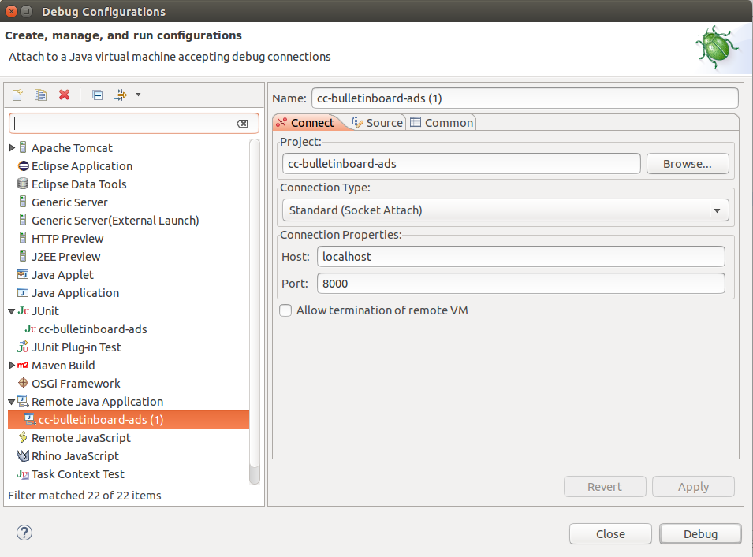
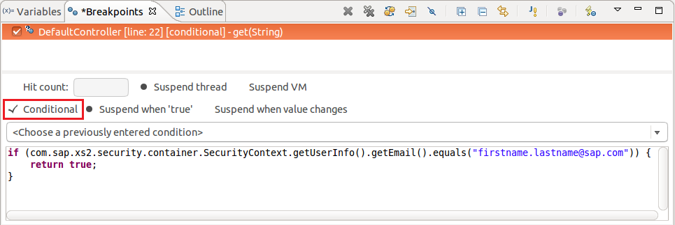

# [Optional] Exercise 15: Debugging an Application Remotely

## Learning Goal

As you do not always have the possibility to reproduce / analyze a particular issue in your local environment you will learn in this exercise how to debug your application that is deployed on Cloud Foundry. 

In this exercise you are going to debug your application on Cloud Foundry remotely by opening a SSH tunnel to your application. CF runtime Diego provides standard SSH access that is secure and restricted to the `org` and `space` of your application.

## Disclaimers for using `cf ssh`
#### 1. Proxyless Environment  
**Note that SAP corporate proxy accepts no outgoing ssh connections so that you can only make use of SSH tunnel in a proxyless environment.** As consequence this exercise can not be done via VPN and in SAP locations which have no proxy less network (e.g. *SAP Internet WLAN* or *Next Generation Internet Access*). As alternative you may do port forwarding via TCP using [`chisel`](https://github.infra.hana.ondemand.com/cloudfoundry/chisel) as described [here](https://jam4.sapjam.com/wiki/show/6PSJs2HhPqwUGO5fGrKqPS). Please make sure to set a secure set of credentials and do not leave the default ones as indicated.

#### 2. SSH in Productive CF Landscapes  
Even on productive landscapes the CF organization admin can enable SSH access and that means you have to guarantee the immutability of your application i.e. to use SSH for troubleshooting only and not for any productive "maintenance" activities. **Note:** According to **SOX (Sarbanes-Oxley Act) regulations** a developer MUST NOT have write access to productive systems which impact financial reporting, which are all applications in case of doubt. 
That means in consequence remote debugging is not applicable for productive applications!

#### 3. Logging vs. Debugging  
This does not replace the necessity and relevance of good logging instrumentation in your productive coding to be able to track down most issues by viewing the application logs and not by debugging the app itself! 


## Prerequisites

- Your application is working and deployed on Cloud Foundry.
- Make sure you use the **sap_java_buildpack** in the manifest.yml file of your application (unfortunately, the community java_buildpack will not work).  
If this is not the case change the manifest.yml file and push your application again to Cloud Foundry:

```
---
applications:
- name: bulletinboard-ads
  memory: 1G
  path: target/bulletinboard-ads.war
  buildpack: sap_java_buildpack
  env:
      # Use the non-blocking /dev/urandom instead of the default to generate random numbers.
      # This may help with slow startup times, especially when using Spring Boot.
      JAVA_OPTS: -Djava.security.egd=file:///dev/./urandom
```

**Note:** The `sap_java_buildpack` contains the SAPJVM (the corporate SAP Java virtual machine) that includes many features as on-the-fly debugging, profiling, extensive monitoring and tracing etc. Furthermore it contains a Hana DB driver.

## Step 1: Switch to Proxyless Environment

Debugging remotely will not work if you sit behind a proxy [see Disclaimer](#disclaimers-for-using-cf-ssh). Therefore you need to

- Switch to **SAP-Internet** network (VPN does not work either!) and
- Disable the proxy system environment settings on your virtual machine provided to you. To do that execute the `localization.sh` script in your console and enter `No` when you get asked if you want to configure a proxy for your network:
```
cd /home/vagrant
source localization.sh
```
> **Note: After you have finished please restart the console so that the system environment variables are updated in the session.**

## Step 3: Enable the Debug Port for the Application

In order to connect to your application with the Eclipse debugger you have to **enable a dedicated debug port** (e.g. port 8000) as described [here](https://wiki.wdf.sap.corp/wiki/display/xs2java/Debugging+on+Cloud+Foundry).

## Step 4: Open an SSH Tunnel

You cannot connect directly to the debug port. Instead you will have to **open an SSH tunnel** as described [here](https://wiki.wdf.sap.corp/wiki/display/xs2java/Debugging+on+Cloud+Foundry).


## Step 5: Connect the Debugger in Eclipse

- Right-click your project in Eclipse and select `Debug As` -> `Debug Configurations...`.
- In the list on the left-hand side select `Remote Java Application` and double-click your application.
- Enter host (`localhost`) and port (e.g. `8000`) in the `Connection Properties` section as it is shown in the screenshot.
- Click `Apply` and then `Debug`.



## Step 6: Set a Breakpoint

In order to debug your application you still have to set a breakpoint to pause the code execution there.
For demonstration purposes go to your `DefaultController` in the package `com.sap.bulletinboard.ads.controllers`
and set a breakpoint at the `return` keyword in the controller's get method.

### Set User-Specific Breakpoint (after Exercise 24, Security) 
Up to now every user in the test landscape is going to run into your breakpoint which is not desirable.
To change this a mechanism is needed which only activates the breakpoint for your own requests. Therefore we make use of a **Conditional Breakpoint**, to check whether the user calling the api matches your own user. **This approach only works if you have already set up the application security (see [Exercise 24](../Security/Exercise_24_MakeYourApplicationSecure.md))**

In order to create a conditional breakpoint in Eclipse just create a usual breakpoint at the desired location. Then select your breakpoint in the `Breakpoints` tab and click on `Conditional` (see screenshot). The textarea below should now be editable. You can enter the boolean expression there which is going to be used to trigger the breakpoint conditionally.

Enter the following expression (please alter the email address!):

```java
if (com.sap.xs2.security.container.SecurityContext.getUserInfo().getEmail().equals("firstname.lastname@sap.com")) {
    return true;
}
```



## Step 7: Call API Endpoint

Call the endpoint `bulletinboard-ads-d012345.cfapps.sap.hana.ondemand.com` either in your browser or via Postman.
When you now switch back to Eclipse the code execution should be paused at the breakpoint you set earlier.
From this point you can debug as usual.

## Step 8: Disable Debug Port

After you are finished you should **disable the debug port** again as described [here](https://wiki.wdf.sap.corp/wiki/display/xs2java/Debugging+on+Cloud+Foundry) and close the tunnel by pressing `CTRL+C` in the command line.

## Used frameworks and tools
- [cf ssh command](https://docs.cloudfoundry.org/devguide/deploy-apps/ssh-apps.html)
- [SAP Java buildpack](https://wiki.wdf.sap.corp/wiki/display/xs2java/SAP+Java+Buildack+for+Cloud+Foundry) 

## Further reading
- [XSA Wiki: Debugging using the SAP java buildpack](https://wiki.wdf.sap.corp/wiki/display/xs2java/Debugging+on+Cloud+Foundry)
- [Debugging using the Community java buildpack](https://github.com/cloudfoundry/java-buildpack/blob/master/docs/framework-debug.md)
- [Instruction: How to open a ssh connection and enable debugging in a proxy environment](https://wiki.wdf.sap.corp/wiki/display/Indigo/How+to+open+a+ssh+connection+and+enable+debugging+in+a+proxy+environment)

***
<dl>
  <dd>
  <div class="footer">&copy; 2018 SAP SE</div>
  </dd>
</dl>
<hr>
<a href="/LoggingTracing/Exercise_14_GettingStarted_With_ELK_Stack.md">
  
</a>
<a href="/Service2ServiceCommunication/Exercise_16_Call_UserService.md">
  
</a>
