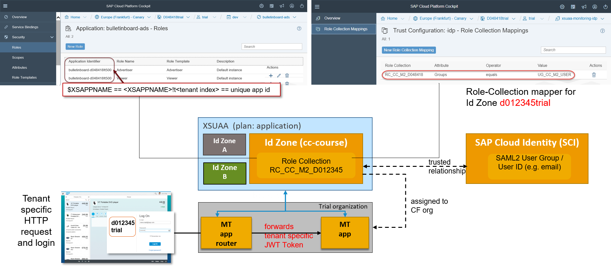

# Multi-tenant Applications

A multi-tenant application serves requests from different customers - so called **_Tenants_**. A service should be designed for multi-tenancy right from the start in order to comply with SAP Corporate Standards, so you want to consider multi-tenancy and application security implications right from the start of development.
For optimal utilisation of resources (database connections, caches, etc.), the same application instance should be able to serve different tenants.

For optimal utilisation of resources (database connections, caches, etc.), the same application instance should be able to serve different tenants.

Your application / service can provide a REST api to get called whenever a tenant (un-)subscribes to it, to perform tenant-specific onboarding steps, e.g. creating a new schema, initializing tenant specific data etc. 

Design decisions have to be made about which resources will be actually be shared among all the tenants and which ones will be instantiated for each and every tenant (which requires a proper isolation mechanism). 

## Tenant at SAP Cloud Platform (Business Domain Model)

From the perspective of the **_Business Domain Model_**, the customer has exactly one **_Global Account_**. A Global Account has one or more **_Subaccounts_**. The semantics of the business term **_Subaccount_** is equal to the semantics of the technical term **_Tenant_**.

The Subaccount respectively Tenant is either an **_Application Consumer (SaaS Use Case)_** or an **_Application Provider (PaaS Use Case)_**. Application Providers have additionally a Cloud Foundry Organization attached to their Subaccount.

Subaccounts have properties which of the most important one is the **_Subdomain_**. The Subdomain serves as the value for the technical property **Tenant ID** (e.g. "cc-course").

The **Tenant GUID** is equal to the GUID of the **_Identity Zone (ID Zone)_**. Identity Zones separate User Management into different **_Security Realms_** for the **_XS User Account and Authentication Service (XSUAA)_**. The Identity Zone connects an **_Identity-Provider (IdP)_** to a Subaccount. That concept enables the customer to bring along his own IdP without the need to copy his user base into the cloud environment during the onboarding process. The ID Zone is created automtically when the Subaccount is created.

The Business Domain Model is depicted in the following picture:


The **Tenant ID** is encoded in the url, for example `https://<tenantId>-<approuter>.<domain>`.

The XSUAA backing service receives the **Tenant ID** from the `approuter` and includes the GUID of the Identity Zone as `zid` when it issues the JWT token. 

> Note you can get the unique **Tenant GUID** from the JWT token via the **SAP Container Security Library**.

## How to setup a multi-tenant application

### Prerequisite: Onboard to AWS Canary

You need either a **_Global Account_** or **_Trial Account_** on CF Landscape **_Canary_**. [Goto this link](https://jam4.sapjam.com/groups/ApFhQ0NCGAzAtXQWsdqB3B/overview_page/p8JIXj2pstIcY7TegLyOp8) and follow the onboarding instructions for either **_Canary Trial_** or **_Request Global Account_**, according to your needs (prototyping or serious development).

In the near future, Application Consumers (SaaS tenants) will be able to subscribe to applications with the [SAP Cloud Platform Cockpit](https://account.int.sap.hana.ondemand.com/cockpit#/home/overview).

### Create a Cloud Foundry Org for your Subaccount
You can see in the screen-shot below the details of a trial Subaccount. The Identity Zone and the **_Trust Relationship_** between **_XSUAA_** and the **_Default SAP IdP (https://accounts.sap.com)_** is created automatically by the system.


In context of your Subaccount you can now attach a Cloud Foundry organization. With that you are ready to deploy your application into the Cloud Foundry Org.

> Note:
> For the course when working on the trial account, the **d012345trial** subdomain is a placeholder for the **tenant id**, which GUID has a 1-1 relationship to the GUID of the **Identity Zone, which is configured for the `D012345trial_trial` CF Org.

### Make your Application Security Setup Tenant-Aware

Follow the [Exercises from 22](https://github.com/ccjavadev/cc-coursematerial/blob/master/Security/Exercise_22_DeployApplicationRouter.md) onwards.

In any case, make sure that you have unbound and deleted your `uaa-bulletinboard` service instance first, before you create a fresh XSUAA service instance with `application` plan (that it is only visible within the CF org). 

And specify per tenant id (subdomain name) an approuter route:  
`cf map-route <approuter name> <cf domain> -n <tenantId>-<approuter host name>`

Now you can test your application via the following url:  
`https://<subdomain/tenantId>-<approuter host name>.cfapps.sap.hana.ondemand.com/endpoint.`  

The expected response code is **_403_**.


### Configure Authorizations for your Application
Start the [SAP Cloud Platform Cockpit](https://account.int.sap.hana.ondemand.com/cockpit#) and navigate to the space of the Cloud Foundry Org where you've deployed your application. Click on one of the microservices of your application (e.g. approuter). Choose "Security" from the main menu on the left and click on sub-item "Roles". XSUAA will have generated default roles if the corresponding role-templates do not contain references to attributes. Create additional roles according to the requirements of your application security model.

Navigate back to the corresponding Subaccount. Again, choose "Security" from the main menu on the left and click on sub-item "Role Collections". Here you can create role-collections and assign to them the roles of your application security model.

When you are done, click on sub-item "Trust Configuration". Click on the default trust configuration "SAP ID Service" to create/modify your role-collection mappings. For testing purposes, you can map the SAML2 User Group **_SAPEMPLOYEES_** to the role-collections you have created in the previous step.



Test your application again: the expected response code is **_200_**.

### [Optional] Provide callbacks for application subscription
Your application / service can provide a REST api to get called whenever a tenant (un-)subscribes to it, to perform tenant-specific on- or offboarding steps, e.g. creating a new schema.  The callbacks are currently called synchronously even this could lead to timeouts.

Basically you have to consider these steps:
- Provide callback endpoints for tenant subscription (PUT) and tenant unsubscription (DELETE)
- There will be a second callback during tenant onboarding. It will be invoked from CIS to get the dependencies
from the subscribed components to all implicit subscriptions.
- Therefore you will need to bind your application to a Local Provisioning Service instance, to get called by CIS (Commercial Infrastructure Services - CRM).

## How to consume a multi-tenant application

In general, **_Application Consumers_** must **_subscribe_** to applications they want to consume. Currently, this is a manual procedure (see option **_3.b._** of [Cloud Foundry Landscape Onboarding](https://jam4.sapjam.com/groups/ApFhQ0NCGAzAtXQWsdqB3B/overview_page/p8JIXj2pstIcY7TegLyOp8) but will be automated soon. One of the important things the subscription procedure is responsible for is to communicate to XSUAA the applications, respectively microservices, to which the new Application Consumer (Tenant) has subscribed to. XSUAA creates a new OAuth2 Client per application for the new Tenant. Only then will the applications and their authorization-models (defined in ```xs.security.json```) appear in the Authorization Administration UIs for the ID Zone of the respective Tenant.

**_Application Providers_** are also in the role of an application consumer for all applications which are reused by provided applications. Specifically, this means that **_Application Providers_** must **_also_** subscribe to applications they want to consume, with one exception: They do not need to subscribe to those applications, which run in their own Cloud Foundry Organization and are therefore provided by themselves.

#### References
- [SaaS Application Registration in CF](https://wiki.wdf.sap.corp/wiki/pages/viewpage.action?spaceKey=CPC15N&title=SaaS+Application+Registration+in+CF)
- [Documentation on SAP CP Help](https://help.sap.com/doc/DRAFT/53ddfc1f9f88403b82d6f975e84e12a3/T11a%202016/en-US/frameset.htm?a877e481b9c040efb6c71a806173b23d.html)

  
## Data Isolation
Data is an important asset of any business and needs to be kept separated and protected per tenant. 
While tenants in a multi-tenant cloud application share the application code and computing resources, data storage must be configured to provide data isolation per tenant (see also [Product Standard Security - 253](https://wiki.wdf.sap.corp/wiki/display/PSSEC/SEC-253)).

There are several ways on how to persist data from different tenants. From a data isolation perspective it needs to be decided whether it is sufficient to introduce just a “tenant discriminator” column in the database or whether an own schema (container) and/or even another database service instance is required.

There are mainly three ways on how to provide data isolation:
- **Shared schema on shared database**: Tables contain a tenant discriminator column (e.g. TENANT). This appproach provides by definition the lowest isolation level: there is no authorization check at database level, restore can affect other tenants and it seems to be the least scalable approach (not appropriate for big data volumes).
- **Separate schema on shared database**: Having an "tenant"-specific schema provides additional capabilities: option to secure data by tenant specific authorization checks on database level (HANA using db-access token), option to enhance schema by customer-specific additional columns / tables, and eventually the option to provide customer dedicated backup and restore service. If implemented properly this approch seems to be an economic approach.
- **Separate schema on separate database**: Offers best "bad neighborhood protection" in terms of data and failure isolation as there is no resource sharing. As the maintenance and resource costs are much higher this seems to be a premium approach for larger customers willing to pay for it. 

Right now backing service instances such as an HDI container or a PostgreSQL service are statically bound to an application at deployment time. But multi-tenancy capable applications that leverage service instances for tenant separation (e.g. each tenant stores its data in a separate HDI schema (container)) need to create additional (schema) instances at runtime whenever a new tenant is added and they also need to connect to the correct instance when processing a request for a specific tenant. 


Therefore the concept of **`Application Managed Service Instances`** is introduced. The concept in short:
- The application is bound to a Instance Manager IM backing service e.g. `managed-hana` instead to a concrete `hana` instance.
- The IM creates / manages during runtime tenant specific backing service instances and remembers their connection information (like VCAP_SERVICES).
- The IM offers an REST-API for the application to get the actual connection information for a tenant. You can make use of the [`Instance Manager Client Library`](https://wiki.wdf.sap.corp/wiki/pages/viewpage.action?pageId=1884767923).

Further details on concept and implementation can be found [here in the XSA Wiki](https://wiki.wdf.sap.corp/wiki/x/hgRUaw).

Obviously, service instance credentials must be cached and open connections must be pooled to minimize the overhead created by the additional calls to the Instance Manager.

No matter which architecture has been chosen to support multi-tenancy, a user of one tenant must not be able to see the data and configuration details of any other tenant and must also not be able to disrupt or negatively impact processing in other tenants as specified as part of [Product Standard Security SEC-253](https://wiki.wdf.sap.corp/wiki/display/PSSEC/SEC-253).

## Further References
- [Multi-tenancy in CP CF](https://wiki.wdf.sap.corp/wiki/display/xs2/Multi-Tenancy)
- [Multi-tenancy in CP CF - Guidelines for SaaS applications](https://wiki.wdf.sap.corp/wiki/display/IoTArch/Multitenancy)
- [Product Standard Security - 253](https://wiki.wdf.sap.corp/wiki/display/PSSEC/SEC-253)
- [Product Standard Security - 273](https://wiki.wdf.sap.corp/wiki/display/PSSEC/SEC-273)
- [“Multi-tenant Applications” in SAP CP Documentation](https://help.hana.ondemand.com/help/frameset.htm?54a76156cd114e5d928642b8dde47b91.html)
- [Step-by-Step description on how to create a Subaccount (aka `PaaS`-tenant) on AWS Canary CF](https://jam4.sapjam.com/groups/DRuoC97ApSanbbXx20g4kb/overview_page/DbkVBP2VFuhYrVqiCoRRmQ)
- [Recording XSA Product Day 2017-01-19: Instance Manager](https://sap.emea.pgiconnect.com/p6fi2mko493?launcher=false&fcsContent=true&pbMode=normal)
- [XSA Wiki: Application Managed Service Instances](https://wiki.wdf.sap.corp/wiki/display/xs2/Application+Managed+Service+Instances)
- [Multitenancy annotations in JPA (EclipseLink 2.3)](http://wiki.eclipse.org/EclipseLink/UserGuide/JPA/Advanced_JPA_Development/Single-Table_Multi-Tenancy)
- [Multitenancy at SuccessFactors](https://wiki.wdf.sap.corp/wiki/display/Successfactors/Multi+Tenancy+and+Database)
- [Service Authentication with OAuth](https://wiki.wdf.sap.corp/wiki/display/xs2/Service+Authentication+with+OAuth)
- [SAP container security library](http://nexusrel.wdf.sap.corp:8081/nexus/#nexus-search;quick~java-container-security)

